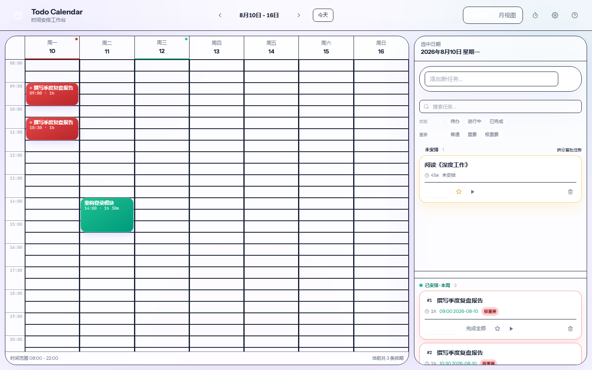

<div align="center">

# 🗓️ Todo Calendar

**A lightweight planner that fuses a classic TODO list with a time-table**

把传统 TODO List 和时间表焊在一起的轻量工作台。

[](LICENSE)
[](https://react.dev)
[](https://vitejs.dev)
[](https://www.typescriptlang.org)
[](https://tailwindcss.com)

**[✨ Live Demo](#live-demo) · [📖 Docs](#features) · [🤝 Contributing](#contributing) · [🛣 Roadmap](#roadmap)**

**English** · [简体中文](README.md)

</div>

---

## 🎬 Demo



_Week view: drag task blocks onto time slots, critical dates highlighted, sidebar split into unscheduled / scheduled_

## What is this?

Todo Calendar is neither yet another TODO app nor yet another calendar. The core problem it solves is the **gap between "knowing what to do" and "knowing when to do it"**.

A traditional TODO list tells you "these things need to be done" but not when; a traditional calendar tells you "this slot is free" but not what to fill in. Todo Calendar puts both on a single screen: **see all unscheduled tasks at a glance + see all free time at a glance**, then drag to match.

> 💡 **Design Philosophy**: Task → Block → Schedule, a three-layer separation. The block is the atomic unit of scheduling, making planning both flexible and controllable.

---

## ✨ Features

| Feature | Description |
| --- | --- |
| **🧩 Workbench Layout** | 70% scheduling canvas on the left + 30% task sidebar on the right, fixed structure with no jumping |
| **✂️ Task Splitting** | Split a task into multiple blocks, each draggable and schedulable independently |
| **🖱️ Drag & Drop Scheduling** | Bidirectional drag-and-drop between task blocks and week/month views powered by `@dnd-kit`, with scale/ rotate overlay animation |
| **🚫 Conflict Detection** | 30-minute granularity, strict overlap prevention with friendly prompts |
| **📅 Week / Month Views** | Week view for fine time-grid scheduling, month view for rough date-level planning |
| **🔥 Critical Highlighting** | Two-level importance marking (important / critical) for both tasks and dates |
| **⏰ Countdown Badge** | Shows "X days / X hours left" for tasks with target times, auto-flags on expiry |
| **🎯 Focus Timer** | Single timer + mini floating bar + panel popup, supports stopwatch mode and task association |
| **🎨 Theme Color Customization** | 6 preset brand colors + custom color picker, CSS-variable-driven across the entire app |
| **🌗 Dark Theme** | Light / dark / follow-system modes, brand color auto-adapts |
| **🔍 Search & Filter** | Multi-dimensional filtering by keyword, status, importance |
| **⌨️ Keyboard Shortcuts** | `S` settings, `?` help, `←/→` navigate weeks, and more |
| **💾 Data Import / Export** | JSON backup for cross-device migration, auto-compatible with older versions via dataVersion |
| **🛡️ Data Safety** | Auto-migration + quota monitoring + corruption protection — no data loss on upgrade |
| **☁️ Zero Backend** | All data in localStorage, pure static deployment |

---

## 🧱 Tech Stack

| Category | Technology | Why |
| --- | --- | --- |
| Build | Vite 5 + TypeScript 5 | Mainstream frontend combo, top-tier DX and ecosystem |
| UI Framework | React 18 | Functional + Hooks, predictable state |
| Styling | Tailwind CSS 3 + Design Tokens + Glassmorphism | Atomic CSS, easy theming, fully controllable visuals |
| State | Zustand 4 (7 independent stores) | Lighter than Redux, intuitive API, clear modules |
| Drag & Drop | @dnd-kit/core | Best drag UX in React ecosystem, solid a11y support |
| Date | date-fns | Functional, tree-shakeable, small footprint |
| Testing | Vitest + Playwright | Fast unit tests + end-to-end coverage of the full flow |

No UI component library is used — all visuals are handcrafted.

---

## 🚀 Quick Start

### Prerequisites

- Node.js ≥ 18
- npm ≥ 9 (or pnpm / yarn)

### Install & Run

```bash
# 1. Clone the repo
git clone https://github.com/yyyhhh0317/todo-calendar.git
cd todo-calendar

# 2. Install dependencies
npm install

# 3. Start dev server (default http://localhost:5173)
npm run dev

# 4. Production build (output to dist/)
npm run build

# 5. Preview the production build locally
npm run preview
```

### Optional Scripts

```bash
npm run lint         # ESLint check
npm run test         # Vitest unit tests (watch mode)
npm run test:unit    # Vitest unit tests (single run)
npm run test:e2e     # Playwright E2E (run npx playwright install chromium first)
```

---

## 🎯 Usage Guide

### 1. Create a Task

Type a title in the "Add new task..." input on the right and press Enter or click "+". A new task comes with one block whose duration equals the estimated time.

### 2. Split a Task

- The "split" button on a task card evenly splits the task into 2 blocks
- Tasks with multiple blocks show an "Edit blocks →" entry to open the split editor for adding/removing blocks and adjusting durations

### 3. Drag to Schedule

- Drag a block from the right sidebar onto a time slot in the week view — it auto-occupies the block's duration
- Drop onto a month-view cell for date-level rough planning, then switch to week view to fine-tune the time
- Scheduled blocks can be dragged to change time, or dragged back to the sidebar to unschedule

### 4. Mark Importance

- The bottom of each task card has a 3-level toggle: Normal / Important / Critical, each with distinct borders, backgrounds, and label colors
- In the month view, click the dot on a date cell to mark it as an "important date" or "critical date"

### 5. Focus Timer

- The "▶" button on a task card starts a timer for that task
- The "⏱" button in the top bar opens the timer panel; a mini timer bar floats at the bottom
- Only one timer can run at a time — forcing you to choose: what are you focusing on right now?

---

## 📁 Project Structure

```
todo-calendar/
├── .github/
│   └── workflows/
│       ├── ci.yml                    # GitHub Actions: lint + unit + build + E2E
│       └── deploy.yml                # GitHub Pages auto-deploy
├── e2e/
│   ├── helpers.ts                    # Playwright fixture (clear localStorage)
│   └── workflow.spec.ts              # Full-flow E2E (create → split → drag → complete → timer)
├── docs/
│   └── screenshot-*.png              # README demo screenshots
├── src/
│   ├── app/
│   │   └── App.tsx                   # Root: workbench + DndProvider + popups
│   ├── features/
│   │   ├── drag/
│   │   │   ├── DndProvider.tsx       # @dnd-kit wrapper (drag animations)
│   │   │   └── dragTypes.ts          # Drag payload / target types
│   │   ├── focus/
│   │   │   ├── components/           # TimerPanel / MiniTimerBar / CountdownBadge / ImportanceToggle
│   │   │   ├── useTicker.ts          # Timer tick hook
│   │   │   └── focusUtils.ts         # Time formatting utils
│   │   ├── schedule/
│   │   │   ├── components/           # TopBar / WeekView / MonthView / ScheduledTaskBlock
│   │   │   ├── scheduleUtils.ts      # Conflict detection, endTime calculation
│   │   │   └── scheduleTypes.ts      # ScheduleEntry / ImportantDay types
│   │   ├── settings/
│   │   │   ├── components/           # SettingsPanel (theme / brand color / import-export)
│   │   │   ├── brandUtils.ts         # Palette generation algorithm
│   │   │   ├── dataTransfer.ts       # Backup import/export + version compat
│   │   │   └── ...
│   │   ├── stats/
│   │   │   └── components/StatsPanel # Time stats + completion heatmap
│   │   └── tasks/
│   │       ├── components/           # TaskSidebar / TaskComposer / TaskBlockCard / TaskSplitEditor
│   │       ├── taskUtils.ts          # Filter / aggregate logic
│   │       └── taskTypes.ts          # Task / TaskBlock types
│   ├── shared/
│   │   ├── components/               # Button / SegmentedControl / Icons / ShortcutsHelp
│   │   ├── styles/                   # globals.css + tokens.css + dark-theme.css
│   │   ├── hooks/                    # useKeyboard (shortcuts)
│   │   └── utils/                    # date / time / cn / id
│   ├── store/
│   │   ├── bootstrap.ts              # Boot orchestration (migration first)
│   │   ├── migrations.ts             # v1 → v2 migration pipeline
│   │   ├── persistence.ts            # localStorage R/W + quota + corruption guard
│   │   ├── useTaskStore.ts           # Task / Block / Schedule / ImportantDay CRUD
│   │   ├── useUIStore.ts             # View switching, date navigation
│   │   ├── useTimerStore.ts          # Timer state
│   │   ├── useThemeStore.ts          # Light / dark / follow-system
│   │   ├── useBrandStore.ts          # Brand color palette persistence
│   │   ├── useFilterStore.ts         # Search & filter state
│   │   └── useSidebarSplitStore.ts   # Sidebar two-zone ratio
│   ├── main.tsx
│   └── index.css
├── playwright.config.ts
├── vite.config.ts
├── tailwind.config.js
├── tsconfig.json
└── package.json
```

---

## 🧠 Design Decisions

| Problem | Decision | Notes |
| --- | --- | --- |
| Time granularity | 30-min slots | 8:00 – 22:00, two slots per hour. 15min too granular, 1hr too coarse |
| Scheduling conflicts | Strictly forbidden | `detectConflicts` checks on drop and prompts |
| Month view planning | Date-level only, no specific time | Fine-tune in week view — rough + fine two-stage flow |
| Timer | Global single instance | Avoids distraction from concurrent timers |
| Persistence | localStorage, 4 independent zones | tasks / taskBlocks / scheduleEntries / importantDays |
| Data model | Task → Blocks → Schedules, 3-layer | Block is the atomic scheduling unit, enables splitting |
| Data migration | Versioned + automatic pipeline | DATA_VERSION + MIGRATIONS registry, safe auto-upgrade on refresh |
| Corruption guard | Backup raw text on parse failure | corrupted:<key> avoids silent data loss |
| Quota monitoring | 5MB quota, 80% warning | Visual progress bar in Settings |
| Theme color | CSS-variable-driven | All 115 brand-* classes follow without any component changes |

---

## Live Demo

> 🚧 Live demo deployment in progress — stay tuned.

Planning to deploy on Vercel. The link will be added here once deployed.

---

## 🛣 Roadmap

### ✅ Done

- [x] Data import / export (JSON) for cross-device migration — v0.3.0
- [x] Visual snap preview to 30-min boundaries when dragging in week view — v0.4.0
- [x] Keyboard shortcuts — v0.4.0
- [x] Task search & filter — v0.4.0
- [x] Dark theme (light / dark / system) — v0.4.0
- [x] Storage schema versioning + migration + quota monitoring (data safety) — v0.5.0
- [x] Vitest unit test coverage (types / utils / store) — v0.6.0
- [x] Playwright E2E: task creation → split → drag-schedule → complete → timer full flow — v0.6.0
- [x] CI pipeline (lint + unit tests + build + E2E) — v0.6.0
- [x] Theme color customization (preset palettes + custom picker, follows dark mode) — v0.7.0
- [x] Drag feel animations (overlay scale, drop easing, snap preview transition) — v0.7.0

### 🚧 Planned

- [ ] Optional PWA + Service Worker for offline use
- [ ] Optional cloud sync backend (Supabase / LAF / other BaaS)

---

## 🤝 Contributing

Issues and PRs are warmly welcome! Whether it's a bug report, a feature suggestion, or a code contribution — all are appreciated.

### Contribution Flow

1. Fork this repository
2. Create a feature branch: `git checkout -b feat/your-feature`
3. Commit your changes: `git commit -m 'feat: add xxx'`
4. Push the branch: `git push origin feat/your-feature`
5. Open a Pull Request

### Before Submitting

```bash
npm run lint   # No lint errors
npm run build  # Production build passes
```

### A Good Issue Includes

- **Bug report**: Reproduction steps + expected behavior + actual behavior + browser/OS info
- **Feature request**: Use case + expected outcome + whether you're willing to implement it yourself

---

## 📄 License

[MIT License](LICENSE) · Copyright (c) 2026

---

<div align="center">

**If this project helps you, a ⭐ Star would be greatly appreciated!**

Open source is hard work — every Star keeps it going.

</div>
