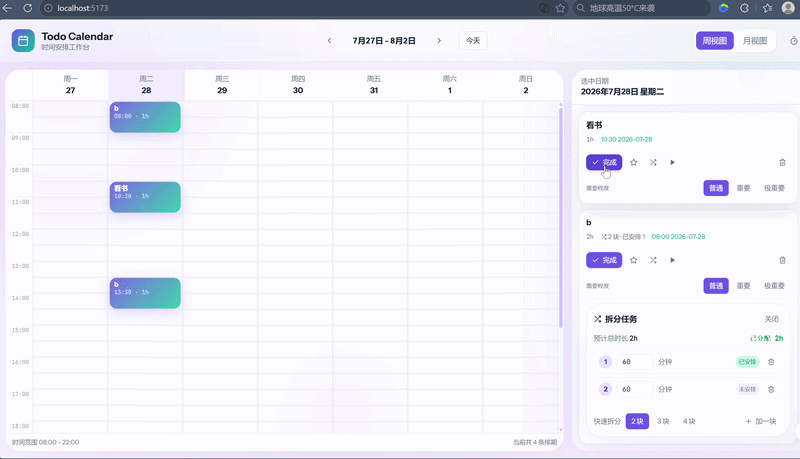
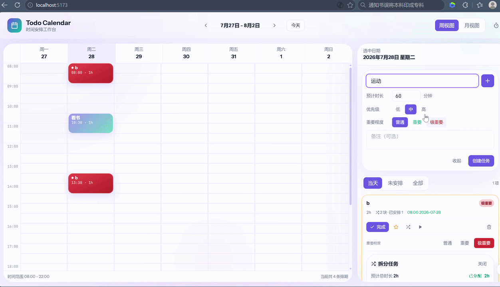

<div align="center">

# 🗓️ Todo Calendar

**把传统 TODO List 和时间表焊在一起的轻量工作台**

A lightweight planner that fuses a classic TODO list with a time-table.

[](LICENSE)
[](https://react.dev)
[](https://vitejs.dev)
[](https://www.typescriptlang.org)
[](https://tailwindcss.com)

**[✨ 在线 Demo](#在线-demo) · [📖 文档](#核心特性) · [🤝 参与贡献](#参与贡献) · [🛣 路线图](#后续路线图)**

[English](README.en.md) · **简体中文**

</div>

---

## 🎬 演示





## 这是什么？

Todo Calendar 不是又一个 TODO App，也不是又一个日历。它解决的核心问题是——**"知道要做什么"和"知道什么时候做"之间的鸿沟**。

传统 TODO List 只告诉你"要做这些事"，但不告诉你什么时候做；传统日历只告诉你"这个时间有空档"，但不告诉你该填什么进去。Todo Calendar 把这两件事放在同一个屏幕上：**一眼看到所有未安排的任务 + 一眼看到所有空闲的时间**，拖一下就完成匹配。

> 💡 **设计哲学**：任务（Task）→ 任务块（Block）→ 排期（Schedule）三层分离。块是排期的最小单元，让排期既灵活又可控。

---

## ✨ 核心特性

| 特性 | 说明 |
| --- | --- |
| **🧩 工作台布局** | 左侧 70% 排期画布 + 右侧 30% 任务侧栏，固定结构不跳动 |
| **✂️ 任务拆分** | 把一个任务拆成多块，每块独立拖拽排期，灵活应对大任务 |
| **🖱️ 拖拽排期** | 基于 `@dnd-kit` 实现任务块与周/月视图的双向拖拽 |
| **🚫 冲突检测** | 30 分钟时间粒度，严格禁止重叠安排，冲突时给出友好提示 |
| **📅 周 / 月视图** | 周视图时间网格精排，月视图日历概览粗排，双击日切到周 |
| **🔥 极重要高亮** | 任务与日期支持「重要 / 极重要」两级标记，视觉分级区分 |
| **⏰ 倒计时徽标** | 对有目标时间的任务显示「还剩 X 天 / X 小时」，到期自动标红 |
| **🎯 专注计时** | 单计时器 + 迷你悬浮条 + 面板弹窗，支持正向计时与任务关联 |
| **💾 本地持久化** | 全部数据保存在 localStorage，刷新不丢失，零后端依赖 |

---

## 🧱 技术栈

| 类别 | 技术 | 选型理由 |
| --- | --- | --- |
| 构建 | Vite 5 + TypeScript 5 | 当下最主流的前端组合，开发体验和生态一流 |
| UI 框架 | React 18 | 函数式 + Hooks，状态可预测 |
| 样式 | Tailwind CSS 3 + 设计令牌 + 玻璃拟态 | 原子化 CSS，主题切换方便，视觉风格完全可控 |
| 状态管理 | Zustand 4（3 个独立 store） | 比 Redux 轻量，API 直观，模块清晰 |
| 拖拽 | @dnd-kit/core | React 生态拖拽体验最佳，无障碍支持完善 |
| 日期处理 | date-fns | 函数式、按需引入、体积可控 |

没有用任何 UI 组件库，所有视觉都是手写的。

---

## 🚀 快速开始

### 环境要求

- Node.js ≥ 18
- npm ≥ 9（或 pnpm / yarn）

### 安装与运行

```bash
# 1. 克隆仓库
git clone https://github.com/yyyhhh0317/todo-calendar.git
cd todo-calendar

# 2. 安装依赖
npm install

# 3. 启动开发服务器（默认 http://localhost:5173）
npm run dev

# 4. 生产构建（产物输出到 dist/）
npm run build

# 5. 本地预览构建产物
npm run preview
```

### 可选脚本

```bash
npm run lint    # 代码检查
npm run test    # 单测（测试文件待补充）
```

---

## 🎯 使用指南

### 1. 创建任务

在右侧「添加新任务」输入框填写标题，回车或点击「+」按钮创建。新建任务默认生成一个与预估时长相等的任务块。

### 2. 拆分任务

- 任务卡片上的「切一刀」按钮可快速把任务平均拆成 2 块
- 有多块的任务会显示「编辑拆分块 →」入口，可进入拆分编辑器手动增删块、调整每块时长

### 3. 拖拽排期

- 从右侧任务栏把任务块拖到左侧周视图的时间格上，自动按块时长占位
- 拖到月视图日期格会做日期级粗排，后续可切到周视图细调时间
- 已安排的任务块可以拖动改变时间，也可以拖回任务栏取消安排

### 4. 极重要标记

- 任务卡片底部有「普通 / 重要 / 极重要」三级切换，不同级别有差异化的边框、背景、标签颜色
- 月视图的日期格上也可点击右上角小圆点标记为「重要日期」或「极重要日期」

### 5. 专注计时

- 任务卡片上的「▶」按钮为该任务启动计时器
- 顶部工具栏的「⏱」按钮打开计时器面板，底部有迷你计时条悬浮显示
- 同一时间只允许运行一个计时器——逼你做出选择：现在到底要做什么

---

## 📁 项目结构

```
src/
├── app/
│   └── App.tsx                     # 根组件：工作台布局 + DndProvider + 弹窗
├── features/
│   ├── drag/
│   │   ├── DndProvider.tsx         # @dnd-kit 封装
│   │   └── dragTypes.ts            # 拖拽 payload / target 类型
│   ├── focus/
│   │   ├── components/             # TimerPanel / MiniTimerBar / CountdownBadge / ImportanceToggle
│   │   ├── useTicker.ts            # 计时器 tick hook
│   │   └── focusUtils.ts           # 时间格式化工具
│   ├── schedule/
│   │   ├── components/             # TopBar / WeekView / MonthView / ScheduledTaskBlock
│   │   ├── scheduleUtils.ts        # 冲突检测、endTime 计算
│   │   └── scheduleTypes.ts        # ScheduleEntry / ImportantDay 类型
│   └── tasks/
│       ├── components/             # TaskSidebar / TaskComposer / TaskCard / TaskSplitEditor
│       ├── taskUtils.ts            # 过滤 / 汇总逻辑
│       └── taskTypes.ts            # Task / TaskBlock 类型
├── shared/
│   ├── components/                 # Button / SegmentedControl / Icons
│   ├── styles/                     # globals.css + tokens.css（设计令牌）
│   └── utils/                      # date / time / cn / id
├── store/
│   ├── useTaskStore.ts             # 任务 / 块 / 排期 / 重要日期 CRUD
│   ├── useUIStore.ts               # 视图切换、日期导航
│   ├── useTimerStore.ts            # 计时器状态
│   └── persistence.ts              # localStorage 读写
├── main.tsx
└── index.css
```

---

## 🧠 设计决策速览

| 问题 | 首版决策 | 备注 |
| --- | --- | --- |
| 时间粒度 | 30 分钟一格 | 8:00 – 22:00，每小时两格。15 分钟太碎，1 小时太粗 |
| 排期冲突 | 严格禁止 | 拖放时 `detectConflicts` 检测并提示 |
| 月视图安排 | 日期级粗排，无具体时间 | 切到周视图再细调，粗排 + 精排两段式 |
| 计时器 | 全局单实例 | 避免多任务并发计时导致分心 |
| 数据持久化 | localStorage 四区独立 | tasks / taskBlocks / scheduleEntries / importantDays |
| 数据模型 | 任务 → 多块 → 多排期 三层分离 | 块是排期的最小单元，支持任务拆分 |

---

## 在线 Demo

> 🚧 在线 Demo 部署中，敬请期待。

计划部署到 Vercel，部署后会在本节放上链接。

---

## 🛣 后续路线图

- [ ] Vitest 单元测试覆盖（types / utils / store）
- [ ] Playwright E2E：任务创建 → 拆分 → 拖拽排期 → 完成 → 计时全链路
- [ ] 周视图内拖入后自动吸附到 30 分钟边界的视觉预览
- [ ] 数据导入 / 导出（JSON），支持跨设备迁移
- [ ] 主题色自定义面板（当前品牌色来自 `tokens.css`）
- [ ] 可选 PWA + Service Worker，支持离线使用
- [ ] 可选云同步后端（接 Supabase / LAF 等 BaaS）

---

## 🤝 参与贡献

欢迎 Issue 与 PR！不论是 bug 反馈、功能建议还是代码贡献，都非常欢迎。

### 贡献流程

1. Fork 本仓库
2. 创建特性分支：`git checkout -b feat/your-feature`
3. 提交改动：`git commit -m 'feat: add xxx'`
4. 推送分支：`git push origin feat/your-feature`
5. 发起 Pull Request

### 提交前请确保

```bash
npm run lint   # 无 lint 错误
npm run build  # 生产构建通过
```

### 好的 Issue 应该包含

- **Bug 反馈**：复现步骤 + 期望行为 + 实际行为 + 浏览器/系统信息
- **功能建议**：使用场景 + 期望效果 + 你愿意自己实现吗

---

## 📄 License

[MIT License](LICENSE) · Copyright (c) 2026

---

<div align="center">

**如果这个项目对你有帮助，欢迎 ⭐ Star 支持一下！**

开源不易，你的每一个 Star 都是我继续做下去的动力。

</div>
